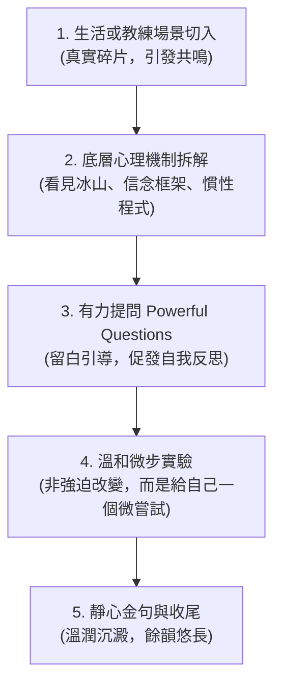

# 心茶記 · 專業教練寫作與風格指引 (Coaching Style Guide)

> **核心願景**：一杯安靜的時光，一顆慢慢了解自己的心。不追求速效答案，只願陪讀者慢慢看見。

---

## 🌿 一、 專業教練精神（避免說教的關鍵準則）

Sunny 作為 ICF-ACC 專業教練，部落格文章的核心精神是**「夥伴關係（Partnership）」**而非「導師教誨（Preaching）」。

### 1. 角色定位對照

| 維度 | 傳統說教 / 導師思維（避免 ❌） | 專業教練思維（心茶記原則 ✅） |
| :--- | :--- | :--- |
| **互動關係** | 高高在上、指導者、給標準答案 | 平等、並肩而坐的探索夥伴 |
| **基本假設** | 讀者是有問題的、需要被指正修正 | 相信讀者本身俱足智慧，所有行為當下皆有正面意圖 |
| **表達語氣** | 指令式、絕對化、強調「應該」 | 邀請式、好奇提問、強調「覺察與選擇」 |
| **文章著力點** | 講述大量道理、灌輸心靈雞湯 | 照亮盲點、拆解底層模式、引導自主思考 |

### 2. 去說教語言轉換表

* ❌ **說教字眼**：「你應該要學會...」、「你必須明白...」、「聽我的沒錯...」、「這就是做人的道理...」
* ✅ **教練式探索**：
  * 「你有沒有遇過這樣的時刻...」
  * 「在教練室裡，我常常看見這個有趣的現象...」
  * 「如果我們暫停一下，往更深處看，那個情緒想保護你什麼？」
  * 「這沒有對錯，只是過去的某個保護機制在發揮作用。」
  * 「如果換一個視角，你會怎麼看待現在的自己？」

---

## 🍵 二、 心茶記的兩種核心風格（雙輪驅動）

細讀站內文章，心茶記其實存在著兩種相輔相成、各具魅力的風格面向，恰如「茶」與「道」的結合：

### 風格 A：【哲思沉澱與文學散文】—— 向內看，安頓靈魂
* **核心使命**：陪伴讀者直視內在脆弱、鬆開執念、轉化觀點、安撫存在焦慮。
* **文字質地**：
  * **詩意與文學感**：善用生活意象與比喻（如潮水、傷疤、晨曦、鬆開拳頭、夜深人靜的一杯茶）。
  * **哲學典故貫穿**：常引用斯多葛學派（愛比克泰德、馬可·奧勒留《沉思錄》）、尼采（命運之愛 Amor Fati）、存在主義哲學或文學家思想。
  * **不急於給方法**：重在「陪伴與同在（Being）」，給讀者足夠的留白與沉澱空間。
* **代表文章**：
  * 《接受，才是改變的開始》
  * 《你真正需要的，是自己的那一聲「夠了」——關於內在自我認可》
  * 《人生的任務，不是追求成功，而是轉換觀點》
  * 《先看見遠方，再走腳下的路——成果導向的哲學》
  * 《情緒不是敵人——與情緒共處的三個練習》
* **適用標籤**：`[人生感悟, 哲學思考, 文學隨筆, 心靈成長, 自我接納]`

### 風格 B：【教練實戰與行動框架】—— 向前走，賦權行動
* **核心使命**：提供清晰的思維羅盤、對話公式與行為框架，幫助讀者在職場、親職或個人成長中破局。
* **文字質地**：
  * **結構分明、邏輯清爽**：善用階段模型（如自信四階段）、對比清單、對話範例、公式（如 成功 = 意志力 + 框架）。
  * **教練有力提問落地**：示範教練在對話中的踩剎車、正向目標提問、冰山需求探詢。
  * **可操作的微練習**：重在「行動與賦權（Doing & Agency）」，提供 5~10 分鐘即可上手的步驟（Step 1/2/3）。
* **代表文章**：
  * 《正向目標提問——別只顧著解決問題，先看見你要去哪裡》
  * 《溝通中的確認藝術——你說的，和我聽到的，是同一件事嗎？》
  * 《聽出話語背後的真實需求——深度傾聽的第一課》
  * 《自信建立的四大階段——從感覺到肯定的成長路徑》
  * 《打破意志力迷思：成功 = 意志力 + 框架》
  * 《創造環境：用獎勵與懲罰機制，打敗拖延》
  * 《當朋友說「我很迷茫」——用「希望訓練」幫他找到方向》
* **適用標籤**：`[教練技巧, 溝通技巧, 傾聽技巧, 框架設計, 習慣養成, 職場溝通]`

---

## 📐 三、 心茶記「五步文章結構法」

為了維持每篇文章的流暢節奏與深度，建議採用以下 5 步結構：

1. **真實場景切入**：從具體生活小事、學員隱私去識別化的教練對話、或內在情緒切入，引發同理。
2. **底層機制拆解**：分析行為背後的心理程式（如：討好、完美主義、戰逃反應、框架限制）。
3. **有力提問（留白）**：拋出 2~3 個不帶預設立場的開放式問題，讓讀者在閱讀中停下來與自己對話。
4. **溫和微步實驗**：提供 1~2 個日常中低阻力的覺察練習（例如：先深呼吸三秒、寫下一句話）。
5. **溫潤收尾金句**：使用引用塊（Blockquote），給予讀者一份安定的力量。

---

## 🗂️ 四、 主題知識庫地圖與「防重複」機制

目前站內已累積 24+ 篇深度文章，劃分為四大核心支柱：

### 1. 支柱與已發表主題矩陣

* **支柱 A：情緒覺察與內在接納**
  * 《情緒不是敵人——與情緒共處的三個練習》
  * 《覺察的力量：從自動反應到有意識選擇》
  * 《為什麼我們總在重複同樣的模式？》
  * 《接受，才是改變的開始》
  * 《你真正需要的，是自己的那一聲「夠了」》
* **支柱 B：深度傾聽與對話藝術**
  * 《先同理，再解決——情緒對話的黃金法則》
  * 《聽出話語背後的真實需求——深度傾聽的第一課》
  * 《溝通中的確認藝術——你說的和我想的是同一件事嗎？》
  * 《承認「所有的行為與想法在當下都是正確的」》
  * 《溝通覺察與停止自我否定：對話沒有絕對對錯》
* **支柱 C：目標、框架與習慣設計**
  * 《找到你的「活法」——生活目的比價值觀更重要》
  * 《當朋友說「我很迷茫」——用希望訓練幫他找方向》
  * 《正向目標提問——先看見你要去哪裡》
  * 《識別「有礙框架」：學會放棄，才能走得更遠》
  * 《打破意志力迷思：成功 = 意志力 + 框架》
  * 《目的比方法更重要：先想清楚 Why，再找 How》
  * 《創造環境：用獎勵與懲罰機制打敗拖延》
  * 《先看見遠方，再走腳下的路——成果導向的哲學》
* **支柱 D：自信建立與人生觀點**
  * 《自信建立的四大階段——從感覺到肯定的成長路徑》
  * 《成功必須由自己定義：別讓別人的期待變成枷鎖》
  * 《釋放對未來的焦慮：行動，是最好的抗焦慮藥》
  * 《人生的任務，不是追求成功，而是轉換觀點》
  * 《成長，要靠不斷給自己機會》

### 2. 新主題發布前的「3 步防重複檢核」

在準備新文章時，助理與作者應共同進行：
1. **檢查主題關鍵詞**：在上述知識庫中比對是否已有高度相似標題。
2. **差異化切入點**：如果主題重合（例如又想寫「目標設定」），必須明確切換切入角度：
   * *過去視角*：Why vs How、成果導向。
   * *全新視角*：例如「目標過度僵化時該如何彈性調整」、「當目標達成後隨之而來的空虛感」。
3. **歷史重複檔案已清理紀錄**：
   * ✅ 已清理：`2026-08-12-confident-building-four-stages.md`（保留更完整的 `four-stages-of-confidence.md`）。
   * ✅ 已清理：`2026-08-06-listening-deeply.md.md`（雙副檔名重複檔案）。

---

## 🎨 五、 視覺版面與排版規範（已更新落地）

1. **字體優先級**：
   * 標題：`Noto Serif TC` / `Noto Serif SC` / `Source Han Serif TC` 繁簡襯線字體，兼顧人文感與清晰度。
   * 內文：`Noto Sans TC` / `Noto Sans SC` / `PingFang TC` / `Microsoft JhengHei`，確保跨裝置細緻呈現。
2. **行距與閱讀節奏**：
   * 內文行距提升至 `1.95`，字距設為 `0.018em`，為漢字保留充足呼吸空間。
   * 段落間距 `24px`，避免文字過於稠密。
   * 引用塊（`blockquote`）取消不自然的中文字斜體（Italic），改採溫潤漸層米色背景與鼠尾草綠邊條。
3. **手機端體驗（Mobile Ergonomics）**：
   * 手機端取消文章次導覽列的黏性懸浮（Sticky），還給螢幕完整的垂直閱讀空間。
   * 窄屏（<= 640px）兩側邊距設為 `18px`，兼顧手機邊緣握持防誤觸與單行字數舒適度。
   * 點擊目標（按鈕、選單、繁簡切換）均滿足最低 44px 觸控體驗。
4. **專屬排版元件**：
   * 可以在 Markdown 中使用 `
...
` 包裹反思提問或教練金句。
