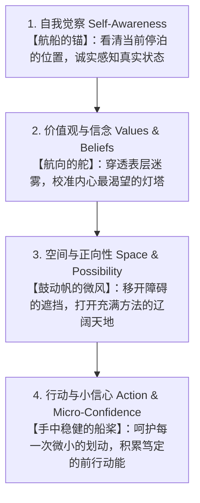

# 让生命自然蜕变：教练对话四元素的交织——一场不求速效的深度相遇

在前面的四篇随笔中，我们分别走过了专业教练会谈中四个至关重要的基石：

1. **自我觉察（核心）**：不急着给答案与评判，如实照见自己，由对方来决定当下是否符合真实需求；
2. **价值观与信念（冰山底层）**：看清所有顽固行为背后的正向意图，探寻多元满足核心价值的方式；
3. **行动与改变（赋权落地）**：精心保护被教练者的「小信心」，迈出那一步小到不可能失败、确切见效的微步；
4. **空间（可能性与正向性）**：按下障碍的静音键，坚定聚焦「要什么」，为生命腾出探索方法的辽阔留白。

很多人会好奇：在真实的教练室里，当一位带着迷茫与重荷的来访者坐下时，这四个看似独立的元素，究竟是如何像乐器合奏一般，交织成一首转化生命的交响乐？

今天，在系列的收官之作中，我们尝试将这四大元素串联起来，还原一处真正发生「心智蜕变」的对话图景。

> 改变从来不是被外界硬生生雕刻出来的，改变是在被深深理解、充分允许与精准赋能之后，从生命内部自然抽枝发芽的奇迹。

---

## 四元素交织的隐喻：旷野中的渡船

如果把一个人在迷茫困境中的探索，比作一艘想要横渡大河的船只，那么这四大元素恰好构成了航行最完美的系统：

1. **自我觉察是「锚」**：在风浪与喧嚣中，先帮来访者把狂乱的心智定住。不再盲目随波逐流，而是诚实看清：「我现在究竟停泊在哪里？这里是我真正想待的地方吗？」
2. **价值观与信念是「舵」**：不再困在「我为什么又做错了」的自责泥潭里，而是顺着冰山潜入深处，看清自己真正想要守护的珍宝，校准灵魂不愿妥协的核心航向；
3. **空间是「风」**：在窒息的困局中拆除心墙，不再被眼前的礁石（障碍）吓退，而是为「我们真正要什么」吹入希望与创造力的清风，让所有的可能性自由舒展；
4. **行动与小信心是「桨」**：每一次划动都不需要惊天动地，教练小心翼翼地护住那一簇微小的火苗，确保跨出的第一桨能清晰感受到水流的推动与船只的前行。

---

## 一场真实对话的微镜头

让我们走进一个典型的教练场景：

一位在职场深陷倦怠、陷入重度内耗的高级主管走进了教练室。他疲惫不堪地抱怨：「团队带不动、老板不理解、每天都在救火，我感觉整个人快被耗空了，但我又不敢放手。」

如果这是一场**传统的导师式建议**，对话往往会滑向方法论的说教：
「你必须学会时间管理」、「你应该去做一次向上沟通」、「你需要更强势一点」。  
其结果是：主管带着一份更沉重的清单离开，内心更加焦虑。

但在**融入了四核心元素的专业教练对话**中，奇迹是这样发生的：

### 第一步：启动自我觉察（唤醒真实感受）
教练不评价他的领导力，也不给管理建议。而是安静地泡一杯茶，温和地问：
> 「听你说了这么多外部的混乱……如果把目光收回来，看看坐在我对面的你，你现在的身心状态，符合你对自己人生的期许吗？」

主管停顿了很久，眼眶泛红：「不符合。我已经很久没有好好睡过觉了，这不是我想要的活法。」  
——**裁判权回到了案主手中，改变的开关第一次被自主按下。**

### 第二步：深潜价值观（化解内在对抗）
面对他「不敢放手」的执念，教练没有劝他「别太累」，而是带着深深的敬意探索冰山底层：
> 「你在如此透支的情况下依然不肯放手，在那个固执的坚持背后，你究竟在守护着一份怎样的珍贵追求？」

主管深吸一口气：「是对团队的责任心，以及我对专业卓越的不妥协。」  
教练肯定了这份崇高，进而邀请：「追求责任与卓越无比珍贵。但除了把自己累倒这一种方式，还有哪些更有智慧的可能，既能成全这份责任，又能让你获得喘息？」  
——**对抗消解了，冰山底层找到了多元表达的出口。**

### 第三步：营造正向空间（突破障碍围困）
当主管试图罗列「但下属能力不够、流程太僵化」时，教练温柔地踩下刹车，为可能性留白：
> 「让我们暂时把这些客观阻碍放在一边。如果所有限制都松开了，在理想的状态下，你真正希望看到的团队与个人图景是什么样的？有哪些创新的机制我们可以尝试？」

房间里的空气瞬间轻盈了起来。主管开始两眼发光地勾勒制度授权、关键节点检核、甚至是跨部门协同的新方案。  
——**不谈障碍、只谈方法，心理空间被无限拓宽。**

### 第四步：呵护小信心（落地第一微步）
最后，面对宏大的重构方案，教练没有让他立刻推行改革，而是小心翼翼地保护他的小信心：
> 「为了让这个新图景开始转动，今天走出这个房间，你回去能做的、小到 5 分钟内就能完成且必然能看到反馈的第一微步是什么？」

主管笑了：「今天下午的周会，我原本准备讲 40 分钟，这次我只讲 5 分钟交代目标，剩下 35 分钟留给他们自主讨论，我只负责倾听。」  
——**小信心被稳妥锚定，行动的飞轮平稳起步。**

---

## 结语：回到生命的完整与自主

教练技术最动人的魅力，从来不是什么玄妙的话术，而是它对人性最深沉的敬畏：

**相信人本身是俱足智慧的、完整的、富有创造力的。**

当一个生命在迷途中：
- 有人以**觉察**陪伴他站定；
- 有人以**价值观**敬重他的初心；
- 有人以**空间**为他的渴望扬起微风；
- 有人以**小信心**护送他稳稳迈出第一步。

生命本身就会找到通往阳光的方向。

愿我们都能在人生的每一次相遇中，少一些指导与说教，多一份安顿与陪伴。  
一杯茶，一段安详的留白，足矣。 ☕

---

【作者简介】  
Sunny｜ICF 专业教练（ACC），专注探索心理运作机制、教练技术与个人成长。  
更多深度教练随笔与哲思，欢迎访问个人专栏《心茶记》：https://coachsunny.github.io/blog/
